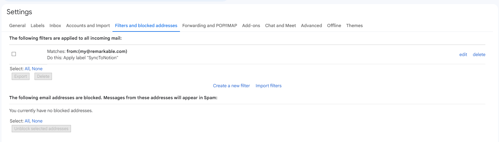

# Gmail 2 Notion
This script takes emails in a label on your gmail, and will upload them to your google drive, and adds that link to a database in your Notion, along with a file name.

after following the steps you will need to put this into a google appscript, "https://script.google.com", and then set up deployment, and a trigger for a period of time, so it will check if any emails go into the "SyncToNotion" label.

## Set Up Gmail
1. set up two labls on your account ("SyncToNotion" and "SyncedToNotion"). 
2. Then go to your account settings, and create a filter for curtain email addresses to automattically go to "SyncToNotion".

### Remarkable Tip
To make it so that your remarkable works with this system, just set up a filter that the emails from; "my@remarkable.com" got to "Sync To Notion".

## Set up Notion
1. set up a Intergration, and get the secrete code, that will look like "secret_A8012yiuqhdao8whd"
2. Connect the databases on your notion to this Intergration. (Otherwise the script wont be able to see these databases, even with the ID's)
3. Connect the ID's in the allocated spaces in the script

## Set up Google Drive
1. make a folder for all files to be sent to
2. get the id of the folder :

3. put that ID into the corrosponding Variable.
